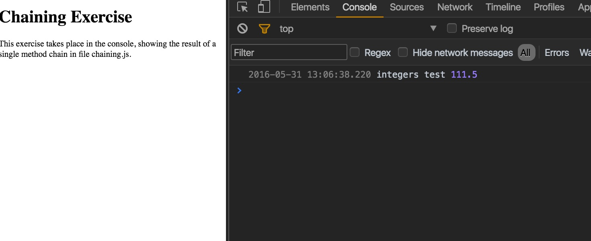

# Array Method Chaining Exercise

**Author**: Megan Ford May 2016 


Created as a student exercise as part of Nashville Software School's Front End Bootcamp curriculum. Please see below for fulfilled requirements: this exercise is not meant to be a finished production app or indication of current skills, but rather a demonstration of skills learned and utilized at the time of creation.


Any/all images are for educational/example purposes only and are all rights reserved original owners. 


## Instructions


NSS Front-End Milestone 2 (Single Page Apps) Exercise 4: 


[Requirements For Project](https://github.com/nashville-software-school/front-end-milestones/blob/master/3-single-page-applications/exercises/SP_JS_ARRAYS_CHAINING.md)


## Install


``` 
git clone https://github.com/MeganCFord/NSS-SPA-4-methodChaining.git
cd 4-array-method-chaining
open index.html
```

[Live Site On Github]()





## License 


[MIT license](LICENSE.md)

